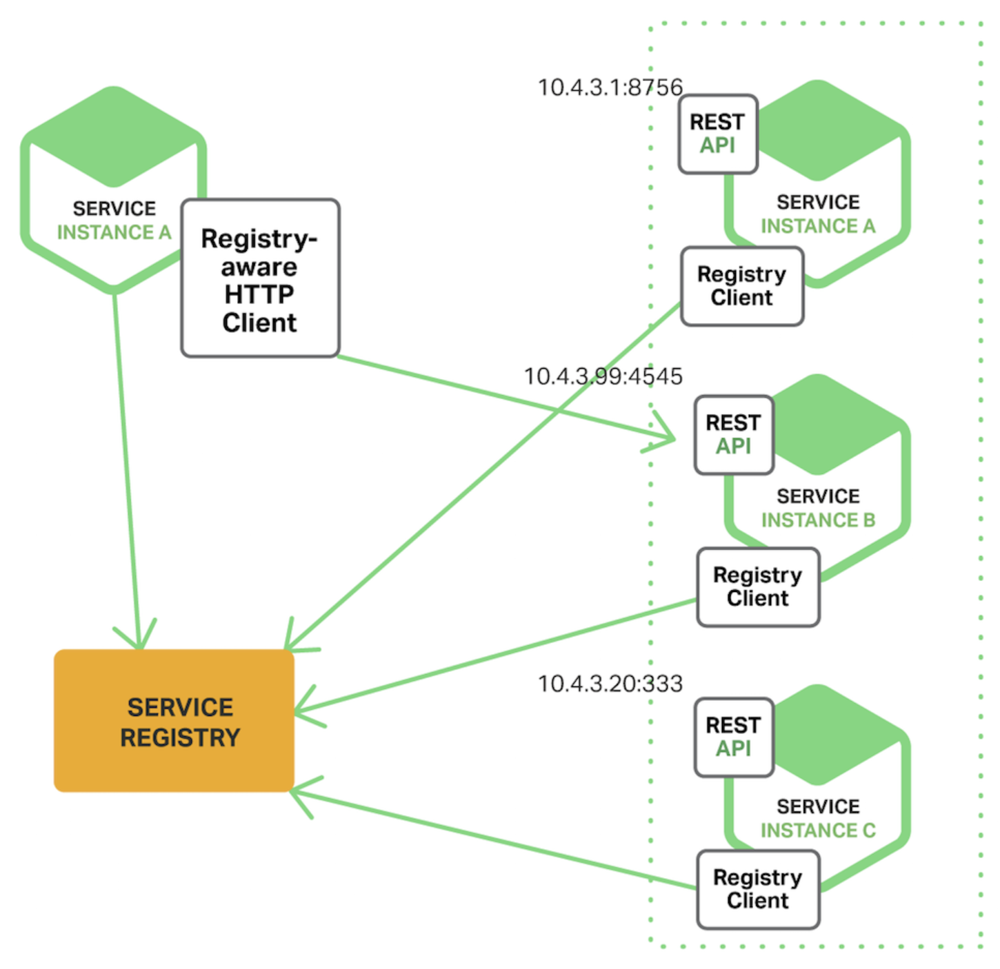

## Spring Cloud Netflix Eureka

### Eureka
- Spring Cloud Netflix에서 제공하는 **Service Discovery** 모듈
- 서비스들의 정보를 Registry에 등록하고 서비스들의 동적 탐색과 Load Balancing을 제공
- Registry를 관리하는 Eureka Server, 등록되는 서비스인 Eureka Client로 구성된 Client-Sever 방식

### Process


- 각 Eureka Client가 Eureka Server에 등록되면 Eureka Server는 Eureka Client의 IP, PORT, InstanceId 정보 저장
- 이후 Eureka Client가 다른 Eureka Client에게 요청을 보낼 때 Eureka Server에서 받아온 정보로 요청 전송
- 서비스 Registry 유지 과정
  - 서비스가 Eureka Server에 등록될 때 Health Indicators 전송
  - Eureka Server는 다른 Eureka Client의 정보 제공하고, Local Cache에 저장
  - 이후 30초(Default)마다 Eureka Server에 Heartbeats를 보내고, Eureka Server는 90초(Default) 안에 Headerbeats가 도착하지 않으면 해당 Eureka Client를 Registry에서 제거

### Operations
[Eureka REST operations](https://github.com/Netflix/eureka/wiki/Eureka-REST-operations)

### Eureka Server
- Config

  | Property                                           | Default          | Description                                                                                                                                                                         |
  |----------------------------------------------------|------------------|-------------------------------------------------------------------------------------------------------------------------------------------------------------------------------------|
  | eureka.server.enable-self-preservation             | true             | Self-preservation mode 활성화 설정 <br/> 네트워크 장애 등이 발생하여 Client와 통신이 되지 않아도 해당 Client를 해제되는 것을 방지하는 모드 <br/> 최근 1분 Actual Heartbeats가 Expected Heartbeats보다 적으면 Self-preservation 모드 활성화 |
  | eureka.server.eviction-interval-time-in-ms         | 60 * 1000ms      | 만료된 Client를 제거하기 위해 해당 시간 빈도로 작업 실행                                                                                                                                                 |
  | eureka.server.renewal-percent-threshold            | 0.85             | 해당 설정을 기반으로 등록된 모든 Client 분당 예상 Heartbeat를 계산 <br/> Expected Heartbeats = 분당 Heartbeats (default : 60 / 30) * instance 수 * renewal-percent-threshold                                |
  | eureka.server.renewal-threshold-update-interval-ms | 15 * 60 * 1000ms | Expected Heartbeats를 계산하는 주기                                                                                                                                                        |
  | eureka.server.response-cache-update-interval-ms    | 30 * 1000ms      | REST Operations에서 응답을 캐시하는 시간 <br/> 해당 시간 이후 REST Operations에서 Client 등록 정보가 바뀐 것을 표시                                                                                               |
  - [more](https://github.com/Netflix/eureka/blob/master/eureka-core/src/main/java/com/netflix/eureka/EurekaServerConfig.java)
- Example
  - Gradle 의존성 추가
  ```groovy
  implementation "org.springframework.cloud:spring-cloud-starter-netflix-eureka-server"
  ```
  - @EnableEurekaServer으로 Eureka Server 활성화
  ```java
  @SpringBootApplication
  @EnableEurekaServer
  public class DiscoveryApplication {}
  ```

  - Eureka Server Config 추가
  ```yaml
  server:
    port: 8761
  
  spring:
    application:
      name: discovery
  
  eureka:
    server:
      ...
    client:
      register-with-eureka: false
      fetch-registry: false
  ```

### Eureka Client
- Config
  
  | Property                                        | Default     | Description                                                                           |
  |-------------------------------------------------|-------------|---------------------------------------------------------------------------------------|
  | eureka.client.register-with-eureka              | true        | Eureka Server Registry 등록 여부                                                          |
  | eureka.client.fetch-registry                    | true        | 해당 Client가 Eureka Server에서 Registry 정보를 가져와야 하는지 여부                                   |
  | eureka.client.registry-fetch-interval-seconds   | 30s         | Client가 Eureka Server에서 Registry 정보를 가져오는 빈도                                          |
  | eureka.client.service-url.defaultZone           |             | Eureka Server Url 목록                                                                  |
  | eureka.server.response-cache-update-interval-ms | 30 * 1000ms | REST Operations에서 응답을 캐시하는 시간 <br/> 해당 시간 이후 REST Operations에서 Client 등록 정보가 바뀐 것을 표시 |
  - [more](https://github.com/Netflix/eureka/blob/master/eureka-client/src/main/java/com/netflix/discovery/EurekaClientConfig.java)
- Example
  - Gradle 의존성 추가
  ```groovy
  implementation "org.springframework.cloud:spring-cloud-starter-netflix-eureka-client"
  ```
  - @EnableEurekaClient으로 Eureka Client 활성화
  ``` java
  @SpringBootApplication
  @EnableDiscoveryClient
  public class DemoApplication {}
  ```
  - Eureka Client Config 추가
  ``` yaml
  spring:
    application:
      name: eureka-client
  
  server:
    port: {port}
  
  eureka:
    client:
      register-with-eureka: true
      fetch-registry: true
      service-url:
        defaultZone: http://127.0.0.1:8761/eureka # Eureka Server 명시
  ```

- Instance Config

  | Property                                             | Default | Description                                                                                                                            |
  |------------------------------------------------------|---------|----------------------------------------------------------------------------------------------------------------------------------------|
  | eureka.instance.lease-renewal-interval-in-seconds    | 30s     | Client에서 Heartbeat를 Server에 보내는 주기                                                                                                     |
  | eureka.instance.lease-expiration-duration-in-seconds | 90s     | Server Registry에서 Client Instance를 제거하기 전에 마지막 Heartbeat를 받은 후 Server가 대기하는 시간 <br/> 항상 lease-renewal-interval-in-seconds 보다 커야함       |
  | eureka.instance.prefer-ip-address                    | false   | 활성화하면 등록 시 hostname 대신 ip 주소 사용 <br/> 컨테이너 기반 배포에서 컨테이너는 DNS 엔트리가 없는 임의의 생성된 hostname을 부여받아 시작, 비활성화의 경우에는 hostname 위치를 얻지 못하기에 활성화 필요 |
  - [more](https://github.com/Netflix/eureka/blob/master/eureka-client/src/main/java/com/netflix/appinfo/EurekaInstanceConfig.java)

### Eureka Dashboard
- http://localhost:8761