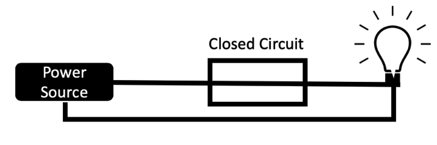
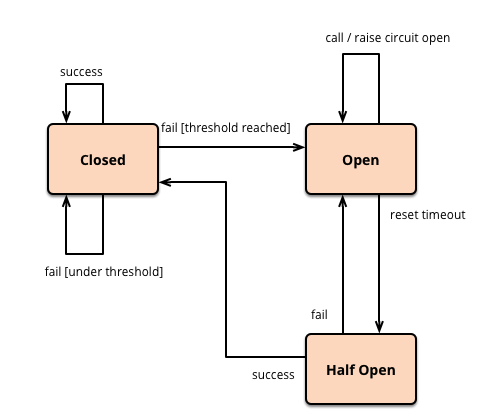
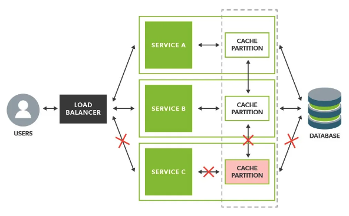
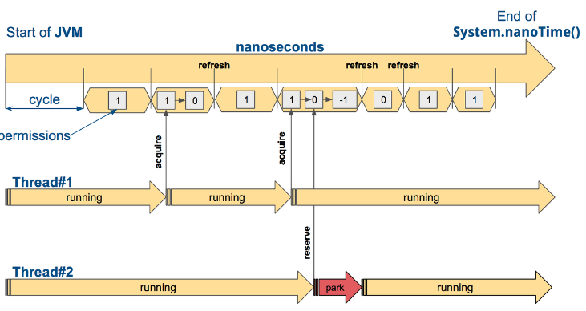

## Resiliency Pattern

### 1. 개요
- 마이크로서비스 애플리케이션 장애를 방지하는 데에 사용할 수 있는 패턴으로, Application 개발시 사용되는 패턴으로는
  Circuit Breaker 패턴과 Bulk Head 패턴이 있다.
- 이러한 패턴에는 Fallback, Retry, Timeout 등의 다른 복원 기법이 포함되는 경우가 많다.
- 이렇게 복원하는 패턴에 대해, 중점은 크게 아래 두가지와 같다.
    - Application 장애 지점을 예측하는 방법
    - Application 장애를 방지하는 방법
- 요청을 전송하거나, 수신하는 서비스는 Application의 장애 지점이 될 가능성이 높다. 하지만, 수백 혹은 수천 개의 Microservice를 사용하는 Uber와 같이, 서비스 전반에 걸쳐서 수십만 개의 범위를 가지고 요청을 수동적으로
  추적하는 것은 매우 절망적이기 때문에, 이러한 Resiliency Pattern을 사용해야 한다.
- Spring Cloud에서는 Resilience4j 의존성을 주입해서 사용할 수 있다.

### 2. Circuit Breaker Pattern
- 서킷 브레이커 패턴은 실제 회로차단기의 동작원리에서 아이디어를 얻고 만들어진 패턴으로, 정상적일 때는 아래 그림과 같이 닫혀있는 모습으로 구성된다.



- 구성된 임계값을 기준으로 요청의 양을 제한하는 데에 사용되는 패턴으로, 서비스 과부하 방지를 할 수 있다.
- 이 패턴은 Application에 상당한 오버헤드를 줄 수 있기 때문에, 무조건적인 사용은 옳지 않다.
- 아래 도표와 같이, 서킷브레이커의 상태는 Open, Closed, Half Open으로 구분되어진다.


- 외부에 장애가 발생했는지를 판단하는 기준은 크게 2가지가 존재한다.
    - **Slow call.** 기준 시간보다 오래 걸린 요청
    - **Failure call.** 실패하거나 오류를 응답받은 요청.


- 아래 그림은 서킷브레이커의 작업 흐름도를 의미한다.



- Open 상태가 되면 특정 시간이 지나야 Half Open 상태가 된다. 만약 Half Open 상태가 되었는데도 외부 서버가 복구되되지 않았다면, 요청들은 실패해서 다시 Open 상태로 변경될 수도 있다. 여기서 중요한 것은 이러한 상태 변경이 자동으로 수행된다는 것이며, 상태 전이를 위한 시간들은 시스템 내부에서 관리되므로 대부분 타임아웃과 관련된 모니터링 시스템을 제공해준다.

### 2.1 Circuit Breaker Pattern - 장점
- 장애 감지 및 격리
    - 만약 장애가 발생한 서비스를 호출한다면 요청이 타임아웃만큼 대기하게 되고, 쓰레드와 메모리 및 CPU 등의 자원을 점유하게 된다. 이것은 결국 시스템 리소스를 부족하게 만들어 장애를 유발할 수 있다.
      장애가 발생한 것은 다른 서비스인데, 장애가 전파되는 것이다. 서킷 브레이커 패턴은 장애가 발생한 서비스를 감지하고, 더 이상 요청을 보내지 않도록 차단함으로써 장애를 격리시켜 준다.
      그래서 장애가 발생한 기능 외의 다른 기능들은 동작하게 하여 시스템의 안정성을 높일 수 있다.


- 자동 시스템 복구
    - 서킷 브레이커는 요청이 차단되면 해당 서비스가 정상인지 주기적으로 검사한다. 그리고 해당 서비스가 복구되었다면 차단이 해제되고, 정상적으로 요청을 보내게 된다. 이러한 부분들은 시스템이 자동으로 해주므로 개발자들이 신경쓰지 않아도 된다. 대부분 타임아웃 등을 위한 모니터링 기능까지 제공하며, 서킷 브레이커가 모든 연동에 적용되면 대시보드를 통해 전체 시스템들의 연동 현황까지 모니터링 가능하다.


- 장애 서비스로의 부하 감소
    - 외부 서비스가 완전히 죽지는 않았는데, slow query 등의 이유로 사용 가능한 쓰레드가 더 남아있지 않을 수도 있다. 이때 계속 요청을 보내는 것은 외부 서비스의 상황을 악화시켜 장애를 유발시킬 수 있다. 그러므로 해당 서비스가 안정을 찾도록 요청을 멈추는 것이 좋은데, 서킷 브레이커를 사용하면 해당 서비스는 더 이상의 요청이 유입되지 않아 장애를 복구할 수 있는 기회를 얻을 수 있다.


### 2.2 Circuit Breaker Pattern - 적용


### 3. Bulkhead Pattern
- 선박의 격벽(Bulkhead)에서 유래된 이름으로, 선박의 구조는 여러 Deck으로 구성되어 있는데, 이를 완전 격리하여 분리시키는 구조이다. 이 때, 격리하는 벽을 bulkhead라고 부르며,
  선박의 외부에 이상이 생겼을 때, 해당 문제가 다른 Deck에 전파되지 않도록 하기 위해 여러 Deck으로 구성되어있다.
- Microservice의 bulkhead 또한, 각 Microservice가 사용할 자원을 분리하고 격리함으로써, 어떤 서비스에 문제가 생겼을 때 다른 서비스에 영향이 가지 않기 위해 구성하는 것이다.
- 이는 장애가 생긴 서비스가 있을 때, 해당 서비스의 Thread Pool만 마르도록 하고, 다른 서비스의 Thread Pool에는 영향을 최소화하는 것을 의미한다.
- Spring Cloud에서는 Resilience4j 의존성을 주입해서 사용할 수 있다.



### 3.1 Bulkhead Pattern - 적용
- bulkhead 기법으로, Resilience4j에서는 아래 두가지 패턴을 제공한다.
    - SemaphoreBulkHead
    - FixedThreadpoolBulkHead

### 3.1.1 SemaphoreBulkhead
- Semaphore를 이용한 기법으로, 적용 방법은 다음과 같다.

|Config Property|Default Value|Description|
|---|---|---|
|maxConcurrentCalls|25|bulkhead에서 최대로 허용할 벙렬 실행 수|
|maxWaitDuration|0|bulkhead가 포화상태일 때, 진입하려는 Thread를 블로킹할 최대시간|

```yml
resilience4j:
  bulkhead:
    instances:
      orderService:
        maxWaitDuration: 5000
        maxConcurrentCalls: 5
```


### 3.1.2 FixedThreadBulkHead
- 이름과 같이, Thread Pool 사이즈를 고정시키는 방법으로, 적용시 사용되는 속성은 도표와 같다.

| Config Property    |Default Value|Description|
|--------------------|---|---|
| maxThreadPoolSize  |Runtime.getRuntime().availableProcessors()| 스레드 풀의 최대 사이즈를 설정|
| coreThreadPoolSize |Runtime.getRuntime().availableProcessors()-1| 스레드 풀의 코어 사이즈를 설정|
| queCapacity        |100|큐 용량 설정|
| KeepAliveDuaration |20(ms)|스레드 수가 코어보다 많을때 초과분 만큼의 Thread가 Idle 상태로 새 태스크를 기다리는 최대 시간 (이 시간이 지나면, Idle Thread 종료)|

```yml
resilience4j:
  bulkhead:
    instances:
      orderService:
        maxThreadPoolSize: 4
        coreThreadPoolSize: 3
        queueCapacity: 8
```


### 4. RateLimiter Pattern
- RateLimiter는 Request를 계속 진행할 수 있을 지 혹은 Request 제한을 초과했는지 여부를 결정한다.
- 즉, 단위 시간동안 얼마만큼의 요청 실행을 허용할 것인지에 대해 제한할 수 있는 메커니즘을 의미한다.
- resilience4j에서 단순하게 Request 수를 제한할 수 있으며, 제한에 걸린 Request는 Queue를 생성하여, 이후에 처리하는 등의 방법을 제공한다.



- 위 그림은 Rate Limiter가 어떻게 동작하는지에 대한 메커니즘을 나타낸 그림이다.
  - System.nanoTime()을 JVM 시작과 함께 일정한 단위 시간으로 쪼갠다. (limitRefreshPeriod)
  - 단위 시간 동안 허가된 요청수(==Permision)를 설정한다. (limitForPeriod)
  

- 사용되는 속성은 아래와 같다.

| Config Property    | Default Value | Description                                    |
|--------------------|---------------|------------------------------------------------|
| timeoutDuration    | 5s            | 호출 Thread가 RateLimit에 대해서, 접근 허가를 얻기위해 대기하는 시간 |
| limitRefreshPeriod | 500ns         | Cycle이 가지는 주기로, Cycle 주기가 끝나면 호출 가능 횟수는 다시 리셋  |
| limitForPeriod     | 50            | Cycle 동안 호출할 수 있는 횟수                           |

```yml
resilience4j: 
  ratelimiter:
    configs:
      default:
        limitForPeriod: 3
        limitRefreshPeriod: 4s
        timeoutDuration: 10s
```


### 5. TimeLimiter Pattern
- 말 그대로 호출에 대해, Timeout을 설정할 수 있는 패턴으로, CompletableFuture 기반으로 사용할 때, Future로 반환될 수 있다.
- CompletalbeFuture는 Java에서 지원하는 비동기 메커니즘의 하나로 자세한 내용은 아래 링크를 참조한다.
  https://www.baeldung.com/java-completablefuture
- Future는 Interface로, 이름 그대로 미래에 반환될 결과를 나타내는 인터페이스를 의미한다. 
  - Future가 결과를 반환받았는지, 기다리고있는지 혹은 실패했는 지를 확인할 수 있다.
  
```java
public interface Future<V> {
    V get() throws InterruptedException, ExecutionException;
    V get(long timeout, TimeUnit unit) throws InterruptedException, ExecutionException, TimeoutException;
    boolean isCancelled();
    boolean isDone();
    boolean cancel(boolean mayInterruptIfRunning);
}
```
- 위 코드에서 ```get()``` 메소드는 말 그대로 결과를 가져오는데, 만약 결과를 반환받지 않았다면 일단 기다린다.  
여기서 중요한 점은, 결과가 반환되기 전까지 Application의 진행을 Block한다.
- ```get()``` 메소드는 timeout을 지정할 수 있으며, 이 시간동안 반환되지 않으면 ```TimeoutException```을 발생시킨다.


- 관련 속성은 아래와 도표와 같다.

| Config Property     | Default Value | Description                              |
|---------------------|---------------|------------------------------------------|
| cancelRunningFuture | true          | timeout이 경과한 후, 자동으로 Future를 취소할지 말지를 결정 |
| timeoutDuration     | 1000ms        | timeout 시간 설정                            |

* cancelRunningFuture가 False일 경우, timeout이 경과했을 때, 작업을 취소하지 않고 그대로 실행을 계속한다. 따라서, timeout 상황이 오더라도, 완료될 때까지 계속 실행된다.

```yml
resilience4j:
  timelimiter:
    configs:
      default:
        cancelRunningFuture: true
        timeoutDuration: 2s
```
