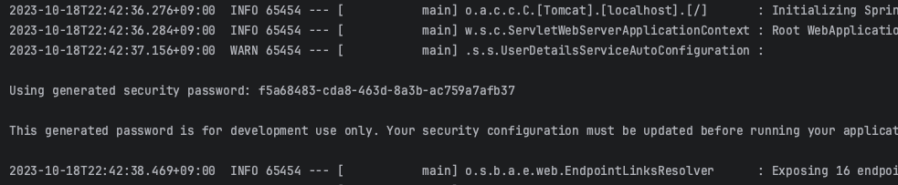
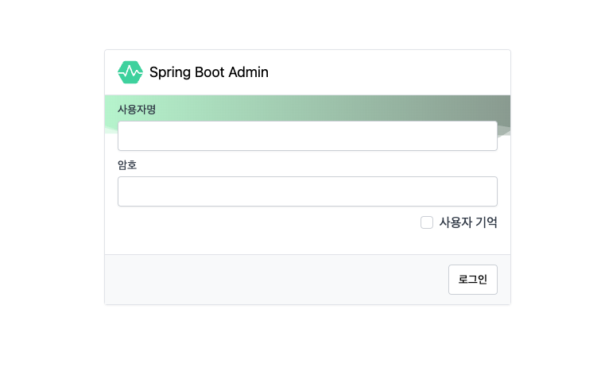
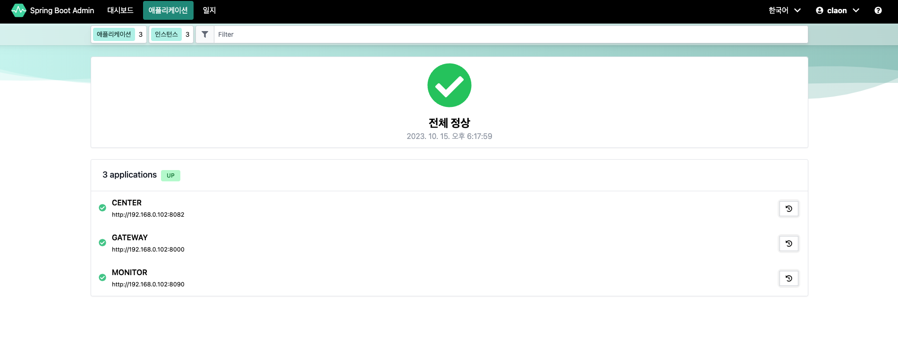
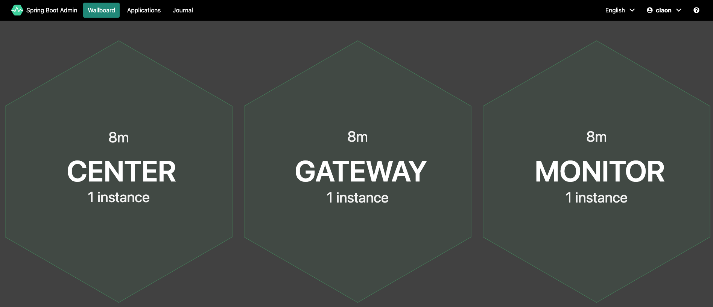
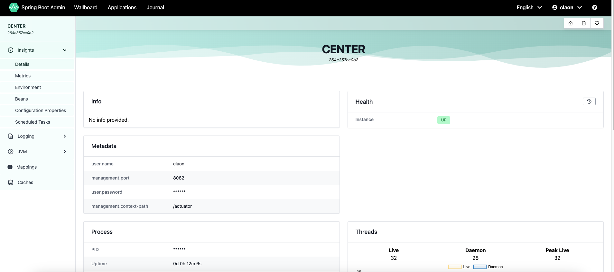
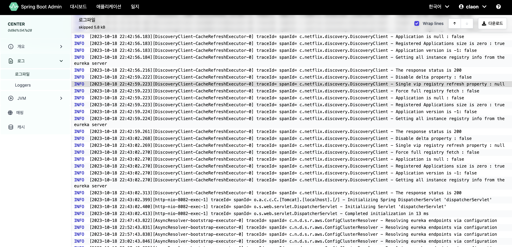

## Spring Boot Admin

### 1. 개요

Spring Application의 중앙 집권화된 관리를 심플하게 만들어주는 오픈소스로, Application에서 Monitoring,
Managing 및 Insight를 얻기위한 web interface를 제공한다.


이는 Spring Boot Actuator에서 제공하는 정보를 보기 좋게 접근 가능한 방식으로 시각화하는 것을 목표로 하는 모니터링 도구라는 의미와 같다.

### 2. 장점
- <span style="color: green">**Centralized Monitoring.**</span>
  Health, Metrics, Logs Check를 더 쉽게 해줌
- <span style="color: green">**Simplified Management.**</span>
  필요할 때, Application을 시작, 정지, 재시작해서 Lifecycle을 컨트롤할 수 있음
- <span style="color: green">**Built-in Security.**</span>
  Spring Security와 쉽게 통합될 수 있으며, 인가된 Admin User만 접근 가능하게 할 수 있음

### 3. Setting
- build.gradle 파일에 spring admin에 관한 Dependency를 추가.
```
// build.gradle
implementation 'de.codecentric:spring-boot-admin-starter-server:3.1.0'
```
- Spring Application에 @EnableAdminServer Annotation을 추가.
```java
@SpringBootApplication
@EnableAdminServer
public class MonitorApplication {

    public static void main(String[] args) {
        SpringApplication.run(MonitorApplication.class, args);
    }

}
```
- 해당 Application에 대한 Port 설정 및 spring security 설정
```yaml
server:
  port: {port} // here !!

spring:
  application:
    name: {Application Name}
  security:
    user:
      name: {ID} // spring security id 설정 
      password: {PASSWORD} // spring security password 설정

management:
  endpoints:
    web:
      exposure:
        include: "*"
  endpoint:
    health:
      show-details: always
---
spring:
  config:
    activate:
      on-profile: {spring-profile}

  boot:
    admin:
      ui:
        cache.no-cache: true
        cache-templates: false

eureka:
  // Eureka Config..

```

- spring security 설정을 따로 해주지 않을 시, Application을 실행할 때 마다 console 로그를 확인하여야 한다.
- 기본 ID는 user이며, PW는 아래 화면과 같이 콘솔에 랜덤 UUID로 생성된다.



- ```boot.admin.ui``` 설정은 아래 링크를 참고하면 된다.

  https://docs.spring-boot-admin.com/current/server.html


- spring boot admin의 log는 로그파일 페이지에 들어가면 1초마다 ```/actuator/logfile```을 요청해서 로그를 갱신해주는데,
  기본값은 1000ms이다. 이를 변경하고싶을 때, 아래와 같이 설정하면 갱신 시간을 변경할 수 있다.

```yml
  boot:
    admin:
      ui:
        poll-timer:
          logfile: 10000 // 10초로 설정
```

- spring admin web에서 관리하고 싶은 Actuator의 endpoint를 아래와 같이 설정할 수 있다.

```yml
management:
  endpoints:
    web:
      exposure:
        include: "*"
        // include: env, health
  endpoint:
    health:
      show-details: always
```

- 보통 asterisk를 통해 actuator의 모든 관리 부문을 추가하지만, 특정 포인트만 관리하고 싶을 경우, 따로 명시를 하면 된다 (```include: env.. ```)
    - asterisk는 쌍 따옴표를 붙여야 한다.

- SpringBoot는 기본적으로 log file을 생성해주지 않는데, 이는 별도로 설정을 해주어야 한다.
    - 본 claon 프로젝트에서는 gateway filter, global exception handler 등에 ```@Slf4j```를 이용하여 logging을 구현하였다.
    - 해당 log file을 생성하기 위해 각 client application마다 아래와 같은 설정을 해주면 된다.

```yml
logging:
  file:
    name: center/logs/info.log

management:
  endpoint:
    logfile:
      external-file: ${logging.file.name}
```

### 3.1 Setting - WebSecurityConfig
- Admin server에 대한 Spring security 설정으로, 아래와 같이 Admin server에 대한 보안 설정을 할 수 있다.

```java
@Configuration
@RequiredArgsConstructor
public class WebSecurityConfig {
    private final AdminServerProperties adminServer;

    @Bean
    public SecurityFilterChain filterChain(HttpSecurity http) throws Exception {
        SavedRequestAwareAuthenticationSuccessHandler successHandler = new SavedRequestAwareAuthenticationSuccessHandler();
        successHandler.setTargetUrlParameter("redirectTo");
        successHandler.setDefaultTargetUrl(adminServer.path("/"));

        http
                .authorizeHttpRequests(authorizeRequests -> authorizeRequests // "/login", "actuator/**" 등등 설정된 리소스는 누구나 접근을 허용
                        .requestMatchers(adminServer.path("/assets/**")).permitAll()
                        .requestMatchers(adminServer.path("/login")).permitAll()
                        .requestMatchers(
                                "/actuator/**",
                                "/v2/api-docs", "/v3/api-docs", "/swagger-resources/**",
                                "/webjars/**", "/swagger/**", "/swagger-ui/**"
                        ).permitAll()
                        .anyRequest().authenticated()) // 이 외의 리소스는 접근 권한이 필요하다는 의미
                .formLogin(formLogin -> formLogin
                        .loginPage(adminServer.path("/login")).successHandler(successHandler)) // login URL 및 Success Handler를 설정
                .logout(logout -> logout.logoutUrl(adminServer.path("/logout"))).httpBasic(Customizer.withDefaults()) // logout 설정
                .csrf(csrf -> csrf.csrfTokenRepository(CookieCsrfTokenRepository.withHttpOnlyFalse()) // 쿠키를 이용하여 CSRF를 보호
                        .ignoringRequestMatchers( // CSRF 비활성화 URL
                                new AntPathRequestMatcher(adminServer.path("/instances"), HttpMethod.POST.toString()),
                                new AntPathRequestMatcher(adminServer.path("/instances/*"), HttpMethod.DELETE.toString()),
                                new AntPathRequestMatcher(adminServer.path("/actuator/**"))
                        ))
                .rememberMe(rememberMe -> rememberMe.key(UUID.randomUUID().toString()).tokenValiditySeconds(1209600))
                .headers(headers -> headers.frameOptions(HeadersConfigurer.FrameOptionsConfig::disable));

        return http.build();
    }
}
```


### 4. Notification
- 여러 가지의 Notification을 연동할 수 있으며, 자세한 내용은 아래 링크에서 확인할 수 있다.
- 대표적으로 Slack, Telegram, Microsoft Teams에 Notification 연동이 가능하다.
- (참고문서) https://docs.spring-boot-admin.com/current/server-notifications.html


## 5. 사용 화면
- "3. Setting"을 완료하고 Application을 실행했을 때, 웹에서 접근했을 시 아래와 같은 로그인 화면을 볼 수 있다.



- 위 화면에서, yml에 설정해놓은 ID/PW를 입력하면 아래와 같은 화면을 볼 수 있다.



- 위 화면에서, 좌측 상단에 대시보드(WallBoard), 애플리케이션, 일지(Journal)를 볼 수 있는데, 대시보드를 누르면, 아래와 같은 화면을 볼 수 있으며, 이는
  각 client instance가 작동된지 얼마나 됐는지를 확인할 수 있다.
- 또한, 인스턴스를 각각 눌러보면 해당 인스턴스에 대한 정보를 얻을 수 있다.
- 아래 화면은 테스트를 위해 discovery, center, gateway, monitor만 실행하였기 때문에, client server만 보이는 것을 확인할 수 있다.



- 위 화면에서 center instance를 클릭했을 경우, 아래와 같이 center instance에 대한 종합적인 정보를 확인할 수 있다.



- 좌측 LNB를 보면, insight, logging, jvm, mapping, caches를 통해 확인하고 싶은 정보를 클릭해서 원하는 정보를 확인할 수 있다.



- 주로 로그파일을 확인할 수 있는데, 이는 해당 client application에 대한 설정 파일에서 Log 파일의 위치를 명시적으로 지정해줌으로써, 해당 경로에서 로그를 가져올 수 있다.
- 아래는 client application에 대한 log 설정이다.

```yml
// ...

logging:
  file:
    name: center/logs/info.log

// ...
```

