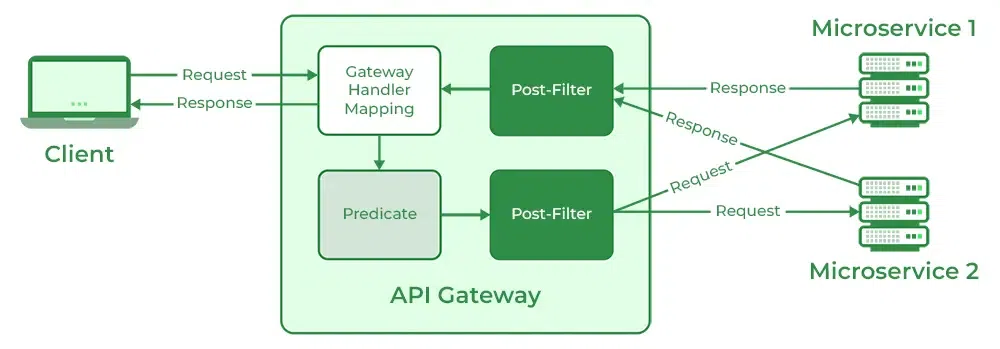

## Spring Cloud Gateway

- API Gateway 구축하기 위한 라이브러리
- Security, Resiliency 등의 cross-cutting concern 제공
- Netty, Spring Webflux 기반 애플리케이션에서 구동 가능



- Client가 Spring Cloud Gateway기반 서버로 요청
- Gateway Handler Mapping에서 Request 매핑, Gateway Web Handler(Predicates)로 전달
- Gateway Web Handler는 매핑되는 요청을 Filter Chain으로 전달, 서비스로 요청 전달

- 의존성 추가
  ```groovy
  implementation "org.springframework.cloud:spring-cloud-starter-gateway"
  ```

### Spring Cloud Netflix Zuul
- Spring Boot 2.4 이상에서 [Maintenance Mode](https://spring.io/blog/2018/12/12/spring-cloud-greenwich-rc1-available-now#spring-cloud-netflix-projects-entering-maintenance-mode) 인입
- Spring Boot 3.0 이상에서 동작하지 않음
- Spring Cloud Gateway와 차이점 
  - Zuul은 Spring Application과 조합하려면 별도의 통합 작업 필요 <br/>
    Spring Cloud Gateway는 별도의 통합 작업이 필요하지 않음
  - Spring Cloud Gateway는 Spring Webflux 기반 애플리케이션에서만 구동 가능
  - Zuul은 Filter로만 동작 <br/>
    Spring Cloud Gateway는 Predicates와 Filter를 조합하여 동작

#### Predicates
- [Route Predicate Factories](https://cloud.spring.io/spring-cloud-gateway/multi/multi_gateway-request-predicates-factories.html)
- 요청이 설정된 조건을 충족하는지 확인하는 요소
- 설정한 Predicate가 매칭되는 것이 없다면, HTTP 404 반환

- Example
  - Property
    ```yml
    spring:
      cloud:
        gateway:
          routes:
            - id: auth # route의 고유 식별자
              # lb: Load Balancing을 사용한다는 의미, Eureka에 등록된 애플리케이션 이름을 명시
              uri: lb://AUTH # 요청을 라우팅할 목적지
              predicates:
                - Path=/auth/**
    ```
  - Spring Bean
    ```java
    @Bean
    public RouteLocator customRouteLocator(RouteLocatorBuilder builder) {
        return builder.routes()
                .route(p -> p.path("/auth/**"))
                        .uri("lb://AUTH"))
                .build();
    }
    ```

#### Filter
- [GatewayFilter Factories](https://cloud.spring.io/spring-cloud-gateway/multi/multi__gatewayfilter_factories.html)
- Gateway에 대한 요청 및 응답을 수정 가능하게 하는 요소 
- RewritePath, Custom Filter 등으로 Filter Chain 구성
- Global Filter를 모두 처리 후, 그 외 Filter 동작

- Example
  - Property
    ```yml
    spring:
      cloud:
        gateway:
          default-filters: # Global Filter
            - name: CircuitBreaker
              args:
                name: CB-GATEWAY
                fallbackUri: forward:/fallback
                statusCodes:
                  - 500
          routes:
            - id: auth
              uri: lb://AUTH
              predicates: 
                - Path=/auth/**
              filters: 
                - RewritePath=/auth/(?<segment>.*), /$\{segment}
                - AuthenticationHeaderFilter
    ```
  - Spring Bean
    ```java
    // Global Filter
    @Bean
    public GlobalFilter customFilter() {
        return new CustomGlobalFilter();
    }
  
    public class CustomGlobalFilter implements GlobalFilter, Ordered {
      @Override
      public Mono<Void> filter(ServerWebExchange exchange, GatewayFilterChain chain) {
          log.info("custom global filter");
          return chain.filter(exchange);
      }
  
      @Override
      public int getOrder() {
          return -1;
      }
    }
    
    // Filter
    @Bean
    public RouteLocator customRouteLocator(RouteLocatorBuilder builder, CustomFilter customFilter) {
        return builder.routes()
                .route(p -> p.path("/auth/**"))
                        .filters(f -> f
                            .rewritePath("/auth/(?<segment>.*)", "/${segment}")
                            .filter(customFilter.apply())
                        .uri("lb://AUTH"))
                .build();
    }
    ```

  - Custom Filter
  ```java
  @Slf4j
  @Component
  public class AuthenticationHeaderFilter extends AbstractGatewayFilterFactory<AuthenticationHeaderFilter.Config> {
      private final HeaderUtil headerUtil;
      private final JwtUtil jwtUtil;
  
      public AuthenticationHeaderFilter(HeaderUtil headerUtil, JwtUtil jwtUtil) {
          super(Config.class);
          this.headerUtil = headerUtil;
          this.jwtUtil = jwtUtil;
      }
  
      @Override
      public GatewayFilter apply(Config config) {
          return (exchange, chain) -> {
              String token = this.headerUtil.resolveAccessToken(exchange.getRequest());
              String userId = this.jwtUtil.getUserId(token);
  
              addAuthorizationHeaders(exchange.getRequest(), userId);
  
              return chain.filter(exchange);
          };
      }
  
      private void addAuthorizationHeaders(ServerHttpRequest request, String userId) {
          request.mutate()
                  .header("X-USER-ID", userId)
                  .build();
      }
  }
  ```

  - Exception Handling
  ```java
  @Bean
  public ErrorWebExceptionHandler tokenValidation() {
      return new JwtTokenExceptionHandler();
  }

  public class JwtTokenExceptionHandler implements ErrorWebExceptionHandler {
      private String getErrorCode(int errorCode) {
          return "{\"errorCode\":" + errorCode + "}";
      }

      @Override
      public Mono<Void> handle(ServerWebExchange exchange, Throwable ex) {
          int errorCode = 500;
          if (ex.getClass() == NullPointerException.class) {
              errorCode = 100;
          } else if (ex.getClass() == ExpiredJwtException.class) {
              errorCode = 200;
          }

          byte[] bytes = getErrorCode(errorCode).getBytes(StandardCharsets.UTF_8);
          DataBuffer buffer = exchange.getResponse().bufferFactory().wrap(bytes);
          return exchange.getResponse().writeWith(Flux.just(buffer));
      }
  }
  ```

  - [More Config](https://cloud.spring.io/spring-cloud-gateway/reference/html/#gateway-starter)